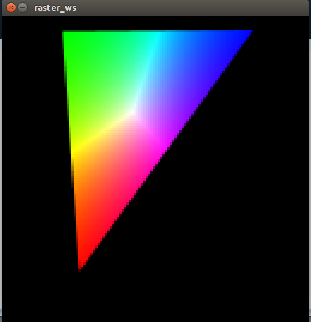

# Taller raster

## Propósito

Comprender algunos aspectos fundamentales del paradigma de rasterización.

## Tareas

Emplee coordenadas baricéntricas para:

1. Rasterizar un triángulo;
2. Implementar un algoritmo de anti-aliasing para sus aristas; y,
3. Hacer shading sobre su superficie.

Implemente la función ```triangleRaster()``` del sketch adjunto para tal efecto, requiere la librería [frames](https://github.com/VisualComputing/framesjs/releases).

## Integrantes

Máximo 3.

Complete la tabla:

| Integrante | github nick |
|------------|-------------|
|Andres Rondon| [amrondonp](https://github.com/amrondonp)             |
|Raul Ramirez| [raulramirezp](https://github.com/raulramirezp)             |
|Juan Carlos Gama| [JuanCarlosUNAL](https://github.com/JuanCarlosUNAL)             |

## Discusión

Resultados:

Se logró rasterizar un triángulo correctamente haciendo 
uso de las coordenadas baricéntricas. Además, se 
implementó un algoritmo de antialiasing el cual 
divide un pixel en 4, 16 y 64 regiones, toma el 
promedio de píxeles de color y regula la intensidad 
del color, permitiendo pintar de una manera más suave 
los bordes del triángulo. Finalmente, se probaron dos algoritmos
de shading, ambos haciendo uso de las coordenadas baricéntricas para
determinar la cantidad de color en un punto dado. El primer
algoritmo, hacía que el centro del triángulo fuera negro, y el segundo
algoritmo (y el elegido) fue aquel que pintaba de blanco el centro geométrico
del triángulo y variando la intensidad de un color a medida de que se acercara a un vértice   Los resultados fueron satisfactorios y se ilustran en la siguiente imagen



## Entrega

* Modo de entrega: [Fork](https://help.github.com/articles/fork-a-repo/) la plantilla en las cuentas de los integrantes (de las que se tomará una al azar).
* Plazo: 1/4/18 a las 24h.
